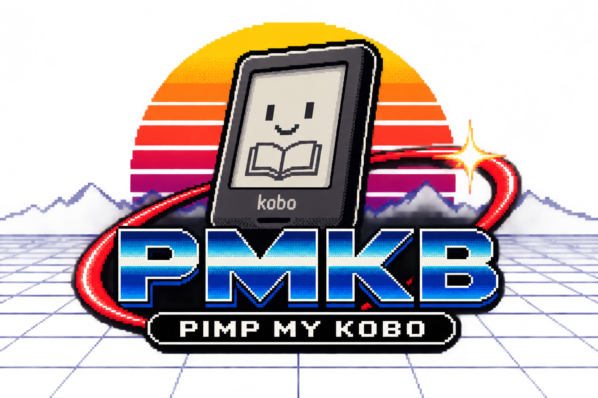

# PimpMyKobo-AuraHD



**Français** | [English](README.en.md)

Résurrection, sauvetage, libération et modernisation de la Kobo Aura HD.

La commande `pmkb` regroupe les outils du projet. [Installation Debian/Ubuntu et WSL](docs/cli-install-fr.md). Les modes physiques restent réservés à Linux natif et à une autorisation explicite de restauration.

## Objectif

Construire un système de lecture léger, libre et indépendant pour la Kobo Aura HD, tout en documentant une procédure de sauvetage reproductible pour les machines abandonnées après une réinitialisation ou une corruption logicielle.

Le projet poursuit deux buts complémentaires :

1. **Sauver une Aura HD** à partir de sa propre microSD, sans redistribuer d'images Kobo propriétaires.
2. **Libérer l'Aura HD** en conservant les couches matérielles nécessaires puis en remplaçant progressivement l'environnement utilisateur Kobo par une pile minimale centrée sur KOReader et des composants libres.

La cible PMKB V1 est **Linux → PMKB → KOReader directement**. Nickel et
l'activation Kobo sont hors du chemin normal. Les couches Netronix/Kobo
nécessaires au matériel restent identifiées et préservées ; cela ne signifie
pas que toute la pile est déjà reconstruite depuis les sources.

## FIRST BOOT #1 — état de préparation

Au 3 octobre 2026, le candidat FIRST BOOT #1 est en cours de reconstruction
et de qualification hors ligne. **Aucun premier boot PMKB réussi n'est établi.**
Les outils ci-dessous sont disponibles sur `integration/pmkb-first-boot-1`
au commit [`a8ce226`](https://github.com/fr4nck/PimpMyKobo-AuraHD/tree/a8ce226bcd46483feb8e35e49f826fa076098bfb),
pas encore intégrés à `main` dans cet instantané.

| Élément | État réel / référence |
| --- | --- |
| Builder KOReader/rootfs | Assemblage local et construction ext4 P1 sous Linux disponibles ; [contrat FR](https://github.com/fr4nck/PimpMyKobo-AuraHD/blob/a8ce226bcd46483feb8e35e49f826fa076098bfb/docs/build-koreader-rootfs-spec-fr.md) |
| Audit ARM/runtime/bootstrap/storage | Audit statique disponible, distinct de l'essai matériel ; [portée](https://github.com/fr4nck/PimpMyKobo-AuraHD/blob/a8ce226bcd46483feb8e35e49f826fa076098bfb/docs/audit-arm-runtime-fr.md) |
| Preflight | Agrégation image/contenu disponible ; sans FAIL ne vaut ni boot réussi ni autorisation d'écriture ; [contrat](https://github.com/fr4nck/PimpMyKobo-AuraHD/blob/a8ce226bcd46483feb8e35e49f826fa076098bfb/docs/preflight-koreader-fr.md) |
| Candidat FIRST BOOT #1 | Résultat de reconstruction final, commit, SHA-256 P1 et rapports reliés à l'image encore à consigner ; [état d'intégration](https://github.com/fr4nck/PimpMyKobo-AuraHD/blob/a8ce226bcd46483feb8e35e49f826fa076098bfb/docs/pmkb-first-boot-1-fr.md) |
| Matériel réel PMKB | **UNQUALIFIED** : boot, framebuffer/E-Ink, tactile, frontlight, montage P3 et USB ; aucun PASS matériel annoncé |
| Calibre | Exigence **V1**, transfert des livres/USB non qualifiés matériellement ; le prototype P3 en lecture seule ne prouve pas ce parcours |

[Protocole FIRST BOOT](https://github.com/fr4nck/PimpMyKobo-AuraHD/blob/ff4e8c1a97d77fe02fe5b1d487c2299633d44fcf/docs/first-boot-qualification-fr.md)
et [modèles de preuves](https://github.com/fr4nck/PimpMyKobo-AuraHD/blob/d64a6e82d10ab1bb8833f3dbd9f464a27de1777a/docs/templates/first-boot/README.md)
sont préparés sur des branches documentaires. Les tests y restent NOT TESTED.
Les liens sont figés pour rester utilisables avant convergence.

**P2/recoveryfs est sanctuarisée** : aucune modification, réaffectation ni
utilisation pour les logs. Préserver aussi pré-P1/HWCONFIG/waveform et P3.
Une construction locale validée exige encore un plan et une autorisation
distincte avant toute écriture physique ; le premier boot ne qualifiera que
les tests réellement exécutés avec preuves.

La [préparation de convergence documentaire/Git](docs/first-boot-convergence-fr.md)
précise l'ordre proposé et les textes historiques à actualiser après validation.

## Matériel cible

- Kobo Aura HD / N204
- Nom de code : `dragon`
- PCBA Netronix : `E606C0`
- Freescale i.MX507 / famille i.MX50
- ARM Cortex-A8
- 512 Mio de RAM
- RAM : `K4X2G323PC`
- écran E-Ink 6,8 pouces
- résolution 1440 × 1080
- stockage système sur microSD interne

## Valeurs observées sur l'exemplaire étudié

L'exemplaire étudié contient un bloc `HW CONFIG v1.7` à l'offset `0x80000` (`524288`).

| Champ | Valeur |
|---|---|
| PCB | `28` → `E606C0` |
| Codename | `dragon` |
| Modèle | Kobo Aura HD |
| RAM | 512 Mio |
| CPU | i.MX50 |
| CPUFreq | 1 GHz |
| DisplayResolution | 1440 × 1080 |
| FrontLight | `TABLE3+` |
| HallSensor | `TLE4913` |
| DisplayBusWidth | `16Bits_mirror` |
| FrontLight LED driver | `SY7201` |

La version v1.7 observée contient 39 octets de configuration. Le champ ajouté après `PCB_Flags` est `FrontLight_LED_Driver`.

## Sources Kobo retrouvées

Les sources spécifiques à l'Aura HD se trouvent dans :

    Kobo-Reader/hw/imx507-aurahd/

Elles contiennent notamment :

    linux-2.6.35.3.tar.gz
    u-boot-2009.08.tar.gz

U-Boot contient les adaptations Netronix, notamment `NTX_HWCONFIG`, les paramètres RAM, la gestion de l'écran E-Ink et le chargement des données matérielles.

## Architecture de démarrage

La chaîne cible conserve la Boot ROM i.MX50, U-Boot/Netronix, HWCONFIG,
paramètres matériels et waveform nécessaires, puis le noyau Linux et une
P1 PMKB minimale lançant KOReader directement. C'est une architecture cible,
pas un démarrage matériel déjà démontré.

## MicroSD originale

Taille physique observée :

    31 914 983 424 octets

Table de partitions : MBR.

| Zone | Offset | Taille | Rôle |
|---|---:|---:|---|
| Zone brute de démarrage | 0 | 9 961 472 octets | U-Boot / kernel / HWCONFIG / données E-Ink |
| Partition 1 | 9 961 472 | 268 435 968 octets | `rootfs` ext4 |
| Partition 2 | 278 397 440 | 268 435 968 octets | `recoveryfs` ext4 |
| Partition 3 | 546 833 408 | reste du support | `KOBOeReader` FAT32 |

La première partition commence à 9,5 Mio, soit 19 456 secteurs de 512 octets.

## Sauvegarde de la zone de démarrage

Les 9 961 472 premiers octets ont été copiés en lecture seule.

SHA-256 :

    4b0c72f9d38a2d81d4d5ffb316b1b0d1efcb8e4bf0fa8610025e75fef837c2b6

Cette sauvegarde binaire n'est volontairement pas publiée dans le dépôt.

## Sauvetage d'une Aura HD après reset interrompu

Sur la machine étudiée, une réinitialisation usine avait commencé puis échoué.

Conséquence observée :

- P1 `rootfs` : ext4 valide, mais pratiquement vide ;
- P2 `recoveryfs` : intacte et cohérente ;
- P3 `KOBOeReader` : recréée par la procédure de recovery.

Le script de récupération Kobo présent dans `recoveryfs` lit le HWCONFIG, sélectionne les artefacts matériels lorsqu'ils sont disponibles, reformate P1/P3 puis extrait `upgrade/fs.tgz` dans P1 et `upgrade/db.tgz` dans P3.

La partition recovery de l'exemplaire étudié contient notamment :

- `upgrade/fs.tgz`
- `upgrade/db.tgz`
- `upgrade/ntx508/u-boot_mddr_512-E606C0-K4X2G323PC.bin`
- `upgrade/ntx508/uImage-E606C0`

Les archives `fs.tgz` et `db.tgz` ont passé un contrôle `gzip -t`. Le recovery a également été contrôlé par son manifeste `fs.md5sum`.

Une nouvelle image ext4 `rootfs` de 256 Mio a été construite localement, alimentée avec `fs.tgz`, vérifiée par `fs.md5sum`, puis contrôlée avec `e2fsck`.

Après écriture ciblée dans P1, le SHA-256 relu directement depuis la microSD était strictement identique à celui de l'image source :

    ADC8995C3F0754CBCF80ABA1540A69CF043DE9823800A359EC75167354B2993C

Cette procédure montre qu'une Aura HD dont `rootfs` a été vidée peut parfois être reconstruite à partir de sa propre partition recovery, sans télécharger d'image système tierce.

## Outils actuels

### `inspect-aura-hd.py`

Inspecteur Python sans dépendance externe et strictement en lecture seule. Il récupère la liste actuelle des disques, lit leur MBR et leur HWCONFIG, confirme `E606C0 / Dragon` uniquement avec le format HWCONFIG attendu et détecte les labels `rootfs`, `recoveryfs` et `KOBOeReader` sans monter les partitions.

Sous Windows :

```powershell
python .\tools\inspect-aura-hd.py --hash-boot
```

Voir [la documentation de l'inspecteur](docs/inspect-aura-hd-fr.md).

### `verify-recovery.py`

Vérificateur en lecture seule d'une partition `recoveryfs` déjà montée ou copiée localement. Il contrôle `fs.md5sum`, le flux gzip complet, les marqueurs de fin tar, le contenu des archives, les artefacts E606C0 et peut calculer leurs SHA-256.

```bash
sudo python3 ./tools/verify-recovery.py /mnt/aurahd-recovery --hash-files
```

Voir [la documentation de `verify-recovery`](docs/verify-recovery-fr.md).

Des tests synthétiques sans firmware Kobo sont présents dans `tests/`. La CI les exécute sous Linux et Windows avec Python 3.10 à 3.13.

## Philosophie de publication

Ce dépôt ne doit pas redistribuer :

- les images complètes de microSD ;
- les dumps personnels ;
- `fs.tgz` ou `db.tgz` extraits d'une liseuse ;
- les blobs Kobo précompilés lorsque leur redistribution n'est pas clairement autorisée.

Le dépôt doit en revanche fournir documentation, inspection, validation, sauvegarde et reconstruction locale à partir des données déjà présentes sur l'appareil de l'utilisateur.

## Règles de sécurité

- lecture seule par défaut ;
- jamais de numéro de disque codé en dur dans un outil public ;
- validation de la taille et des offsets avant toute écriture ;
- identification du HWCONFIG et du PCBA ;
- sauvegarde obligatoire avant modification ;
- vérification cryptographique après écriture ;
- préservation obligatoire de P2/`recoveryfs`, du HWCONFIG et des zones hors cible.

### Attention aux écritures du système d'exploitation

« Outil en lecture seule » ne signifie pas que le système hôte ne peut rien écrire sur la carte.

- Sous Windows, toujours **annuler** les propositions de formatage des partitions ext4 et éviter d'ouvrir inutilement P3 FAT32 pendant une opération de préservation.
- Sous Linux de bureau, désactiver l'automontage : un montage ext4 en lecture-écriture peut rejouer le journal. Pour les manipulations sensibles, préférer une image locale ou placer le périphérique identifié en lecture seule côté noyau avant analyse.

## État du projet

- [x] Sources officielles Aura HD retrouvées
- [x] MicroSD originale retrouvée et cartographiée
- [x] Zone de boot sauvegardée
- [x] HWCONFIG v1.7 décodé
- [x] PCBA identifié : E606C0 / Dragon
- [x] Recovery factory analysé
- [x] Cas réel de `rootfs` vidée diagnostiqué
- [x] `rootfs` reconstruite depuis `recoveryfs/upgrade/fs.tgz`
- [x] Reconstruction vérifiée par MD5, e2fsck et SHA-256
- [x] Outil `inspect-aura-hd` en lecture seule
- [x] Outil `verify-recovery` en lecture seule
- [x] Tests synthétiques sans blobs Kobo
- [x] CI Linux/Windows Python 3.10–3.13
- [ ] Valider `inspect-aura-hd` sur la microSD physique via le lecteur Windows
- [ ] Extraire et documenter précisément la waveform E-Ink
- [x] Reconstruction locale, import historique et simulation sur fichiers
- [x] Commande `pmkb` et paquet Debian/Ubuntu/WSL
- [x] Outils de sauvegarde native et de vérification hors ligne disponibles
- [ ] Qualifier la sauvegarde native sur matériel réel
- [ ] Qualifier la restauration P1 et le démarrage sous Linux Live
- [x] Premier atelier Qt/PySide6 pour les opérations locales disponible
- [ ] Compiler U-Boot et le kernel de référence
- [x] Prototype PMKB minimal et builder KOReader disponibles sur la branche d'intégration
- [x] Audits ARM/runtime/bootstrap/storage et preflight disponibles sur la branche d'intégration
- [ ] Valider et consigner le candidat FIRST BOOT #1 reconstruit
- [ ] Qualifier le premier boot PMKB et ses composants matériels
- [ ] Qualifier le parcours livres/USB Calibre requis pour V1
- [ ] Remplacer et reconstruire les composants conservés quand leur remplacement est démontré

## Documentation

- [Démonter l'Aura HD et accéder à la microSD interne](docs/disassembly-fr.md) — avec photos originales, sources iFixit/MobileRead et version texte pour Lynx.
- [Version texte / Lynx du guide de démontage](docs/disassembly-lynx-fr.txt)
- [Index de la documentation](docs/README.md)
- [Roadmap et prochaines étapes](docs/ROADMAP.fr.md)
- [Sauvetage d'une Aura HD](docs/rescue-fr.md)
- [Retrouver les fichiers de recovery](docs/retrouver-fichiers-fr.md)
- [Inspecteur Aura HD](docs/inspect-aura-hd-fr.md)
- [Vérifier recoveryfs](docs/verify-recovery-fr.md)
- [Matériel Aura HD](docs/hardware-fr.md)
- [HWCONFIG Netronix](docs/hwconfig-fr.md)
- [Partitionnement](docs/partition-layout-fr.md)

## Licence

La licence du code propre au projet reste à choisir. Les composants et sources tiers conservent leurs licences respectives.
