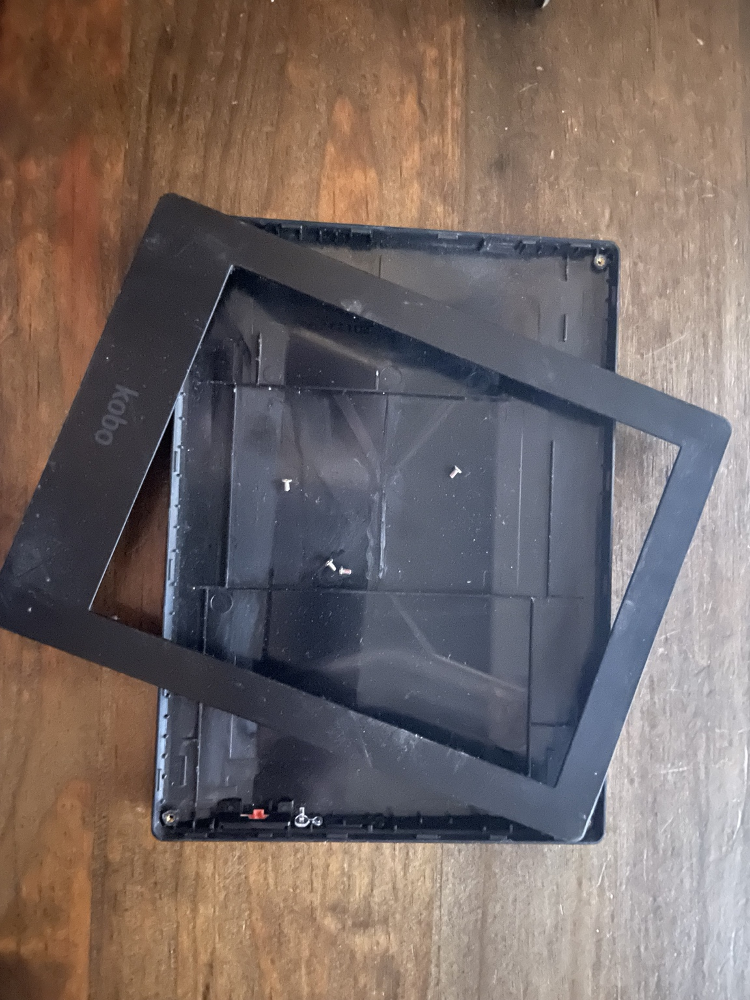
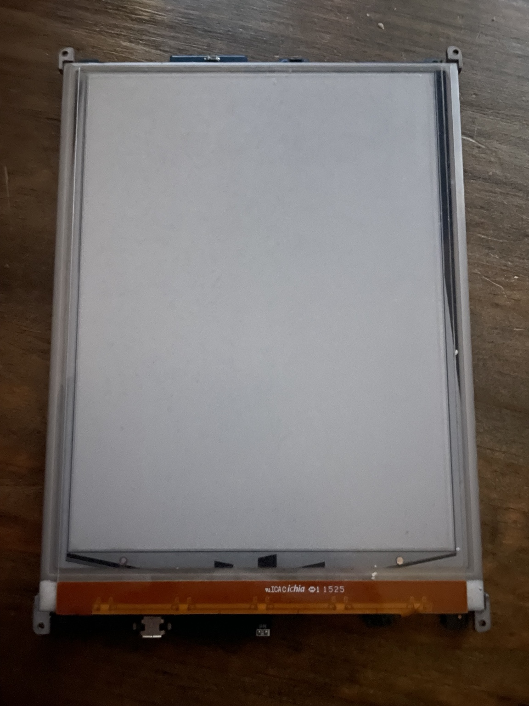
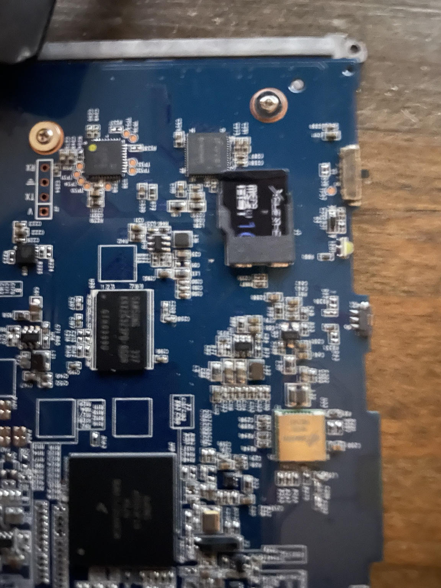
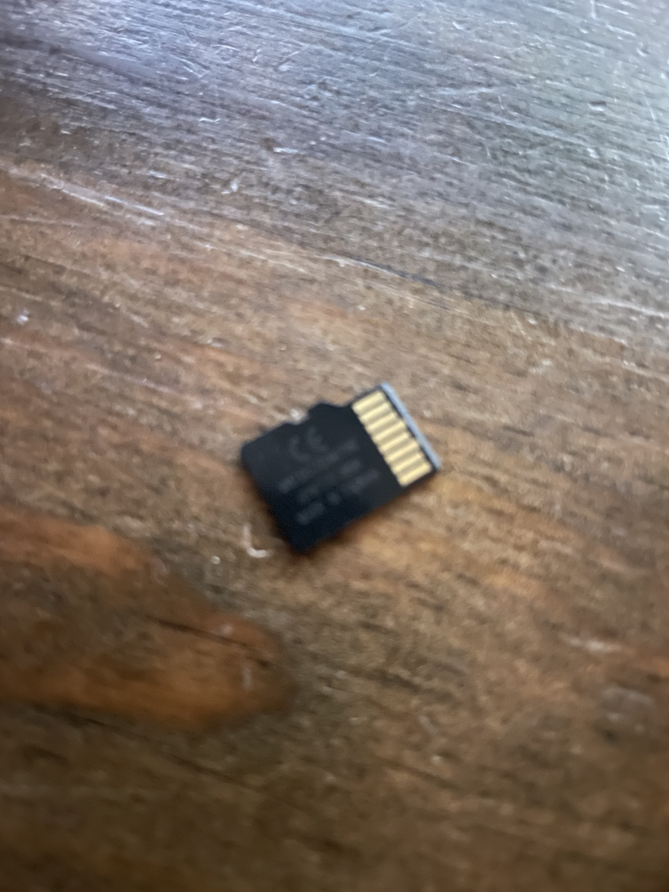

# Kobo Aura HD disassembly

[Français](disassembly-fr.md) | [Plain text / Lynx](disassembly-lynx-en.txt)

This guide explains how to open a **Kobo Aura HD / N204** in order to reach its **internal system microSD card**.

The procedure starts from a real Aura HD disassembly and is then **cross-checked against iFixit and MobileRead**, with sources attached to each relevant step. The photographs show the device disassembled for this project; no iFixit or MobileRead photographs are reproduced here.

> **Project rule:** external technical information is cited; observations made directly on the device are identified as such.
>
> **Text navigation:** no step depends on photographs. In Lynx or a terminal without image rendering, the alt text, captions and ASCII diagrams carry the necessary information. A [plain-text version](disassembly-lynx-en.txt) is also provided.

## Before you start

Power the reader off completely and disconnect USB.

Recommended tools:

- plastic spudger, guitar pick or thin plastic card;
- precision Phillips screwdriver;
- clean, flat, non-conductive work surface;
- microSD reader for the later backup stage.

Avoid metal tools when opening the case whenever possible. The E-Ink panel is mechanically fragile and should not be flexed.

## Operation map

```text
      KOBO AURA HD
           |
           v
  +-------------------+
  | front bezel       |
  +-------------------+
           |
       unclip it
           v
  +-------------------+
  | 4 internal screws |
  +-------------------+
           |
       remove them
           v
  +-------------------+
  | display + PCB     |
  +-------------------+
           |
   lift from rear case
           v
  +-------------------+
  | back of PCB       |
  |                   |
  | [system microSD]  | <--- target
  +-------------------+
```

---

## 1. Remove the front bezel

Start at a corner with a thin plastic tool and work slowly around the edge, releasing clips one after another instead of pulling hard on the bezel.

```text
Simplified side view

       front bezel
   __________________
  /                  \
 /____________________\
   ^  ^  ^  ^  ^  ^
      plastic clips

   +------------------+
   |    rear case     |
   +------------------+
```



*Front bezel and rear shell separated.*


*Close-up of the perimeter clips. This view shows why working clip by clip is preferable to pulling on the bezel.*

The MobileRead wiki reports **at least six latches along each long edge**, plus double-sided tape between the bezel and display. iFixit starts at the bottom-right corner with a plastic spudger and works along the bottom and around the device.

**Sources:**

- iFixit — [Kobo Aura HD Screen Replacement](https://www.ifixit.com/Guide/Kobo+Aura+HD+Screen+Replacement/96135), step 1;
- MobileRead Wiki — [Aura HD](https://wiki.mobileread.com/wiki/Aura_HD), *Hacking* section;
- MobileRead Forum — [Aura HD Replacing internal SD card?](https://www.mobileread.com/forums/showthread.php?t=214272).

---

## 2. Remove the four screws holding the electronics assembly

After the bezel is removed, four screws near the corners hold the **display + motherboard assembly** to the rear case.

```text
   o----------------------o
   |                      |
   |       display        |
   |                      |
   o----------------------o

   o = screw to remove
```

MobileRead calls these **PH00** screws; iFixit specifies **Phillips #000**. Those names are close but not exactly identical, so use the precision bit that properly fills the screw head without forcing it.

**Sources:**

- iFixit — [Kobo Aura HD Screen Replacement](https://www.ifixit.com/Guide/Kobo+Aura+HD+Screen+Replacement/96135), step 2;
- MobileRead Wiki — [Aura HD](https://wiki.mobileread.com/wiki/Aura_HD).

---

## 3. Lift the display + motherboard assembly from the rear shell

Once the four screws are out, the electronics assembly can be removed from the back plate.

You do **not** need to separate the display from the motherboard to reach the system microSD card.

```text
          FRONT
     +-------------+
     | E-Ink panel |
     +-------------+
           ||
           \/
     +-------------+
     | motherboard |
     +-------------+
          BACK
```



*E-Ink display module removed from the shell. Handle the panel without flexing it.*

**Source:**

- iFixit — [Kobo Aura HD Screen Replacement](https://www.ifixit.com/Guide/Kobo+Aura+HD+Screen+Replacement/96135), step 2.

---

## 4. Disconnect the battery before handling the microSD

This reduces the risk of shorting the board or manipulating storage while the motherboard is still powered.

The battery connector is lifted **perpendicular to the motherboard**. Do not pull on the wires.

```text
          battery wires
              ||
          [connector]
              ^
              |
          lift upward

  ============================  motherboard
```

**Source:**

- iFixit — [Kobo Aura HD Screen Replacement](https://www.ifixit.com/Guide/Kobo+Aura+HD+Screen+Replacement/96135), step 3.

---

## 5. Identify the internal system microSD

The Aura HD uses a **removable microSD card as system storage**. MobileRead places it on the **back side of the board**, i.e. the side opposite the display.

```text
Back of motherboard — functional map

+------------------------------------------------+
|                                                |
|  [ SYSTEM microSD ]                            |
|       ^                                        |
|       +---- boot / rootfs / recovery           |
|                                                |
|                         [ battery ]             |
|                                                |
|        electronics / CPU / RAM / controllers   |
|                                                |
|                               [USB] [ext. microSD]
+------------------------------------------------+
```



*The system microSD still installed on the motherboard. This is the card to preserve and back up when working on the internal system.*

### Do not confuse the two microSD roles

```text
INTERNAL SYSTEM microSD
  -> contains the Kobo system
  -> rootfs / recoveryfs / KOBOeReader
  -> should be backed up before modification

USER EXPANSION microSD SLOT
  -> accessible from the outside edge
  -> located near the USB connector
  -> is NOT the system card
```

This distinction was directly confirmed on the device disassembled here.

**Sources:**

- MobileRead Wiki — [Aura HD](https://wiki.mobileread.com/wiki/Aura_HD);
- MobileRead Forum — [Aura HD Accessible Internal uSD card](https://www.mobileread.com/forums/showthread.php?t=217702);
- MobileRead Forum — [Aura HD Replacing internal SD card?](https://www.mobileread.com/forums/showthread.php?t=214272).

---

## 6. Remove the system microSD

With the battery disconnected, remove the card without bending it or forcing the socket.



*Original system microSD after removal.*

**Do not write anything to it yet.**

The recommended first step is a **read-only inspection**, followed by a **full backup** before any repair attempt.

Continue with:

1. [Inspect the microSD read-only](inspect-aura-hd-en.md)
2. [Recover the recovery files](recover-files-en.md)
3. [Verify `recoveryfs`](verify-recovery-en.md)
4. [Understand the rescue procedure](rescue-en.md)

A 2015 MobileRead report explicitly describes recovering books and the `.kobo` directory after removing the Aura HD internal microSD from a device with an unusable touchscreen.

**Source:**

- MobileRead Forum — [how to recover aura hd internal sd data on a broken screen?](https://www.mobileread.com/forums/showthread.php?t=266182).

---

## 7. Reassembly and touchscreen test

Reassemble in reverse order.

One important trap: **the touchscreen may not respond until the front bezel is reinstalled**. Both iFixit and MobileRead document this behavior.

Do not immediately diagnose a failed touchscreen when testing the reader while it is still open.

**Sources:**

- iFixit — [Kobo Aura HD Screen Replacement](https://www.ifixit.com/Guide/Kobo+Aura+HD+Screen+Replacement/96135), step 10;
- MobileRead Wiki — [Aura HD](https://wiki.mobileread.com/wiki/Aura_HD).

---

## Text-browser and accessibility design

This guide is intentionally usable without graphics:

- every photograph has meaningful **alt text**;
- all essential information is repeated in the adjacent prose;
- critical layouts are reproduced as ASCII diagrams;
- no step depends solely on arrows or graphical annotations;
- a plain-text edition is available as [`disassembly-lynx-en.txt`](disassembly-lynx-en.txt).

Classic ASCII is preferred over Unicode braille-art because it is more robust across Lynx, SSH sessions, serial consoles and old terminals. A real refreshable braille display can still present the textual content through the user's accessibility stack.

---

## Sources and acknowledgements

This documentation does not claim discovery of the Aura HD opening method.

It combines:

- a real-world disassembly of the project device;
- the iFixit **Kobo Aura HD Screen Replacement** guide;
- the **MobileRead Wiki — Aura HD** page;
- historical MobileRead forum reports about opening the case and accessing the internal microSD.

### Main references

- iFixit — https://www.ifixit.com/Guide/Kobo+Aura+HD+Screen+Replacement/96135
- MobileRead Wiki — https://wiki.mobileread.com/wiki/Aura_HD
- MobileRead — https://www.mobileread.com/forums/showthread.php?t=214272
- MobileRead — https://www.mobileread.com/forums/showthread.php?t=217702
- MobileRead — https://www.mobileread.com/forums/showthread.php?t=266182

The MobileRead Aura HD wiki page credits Dale DePriest, Chris Ridd and an anonymous contributor, and states that its content is available under **Creative Commons Attribution-NonCommercial-ShareAlike**.

The photographs in this guide come from the Aura HD disassembled for this project; they do not reproduce iFixit or MobileRead photography.
